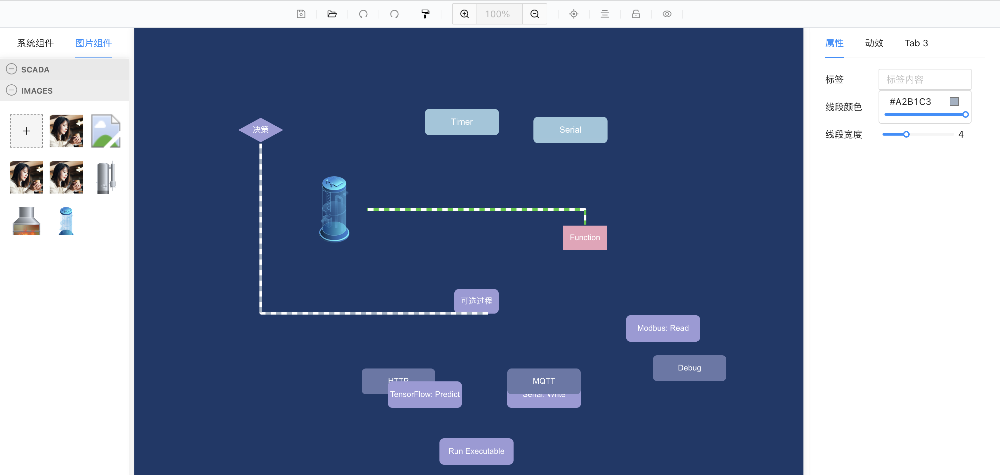
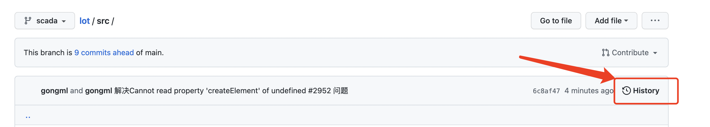

# lot

更轻松地构建面向客户的 IoT 应用程序



# 在线体验

[https://tsuyoii.github.io/x6_scada_HMI/](https://tsuyoii.github.io/x6_scada_HMI/)

# 查看历史



# 下载使用

#### 注意 ⚠️：目前还在开发中，暂未能实现传入数据或自定义等功能，预计下一版本实现，敬请期待

```
npm install lot_scada
```

```
import XScadas from 'lot_scada/dist';
import 'lot_scada/dist/assets/css/main.css';

<XScadas />
```

# 发布

## 发布 npm

```
修改package.json中的
    "main": "./dist/index.js",
    "files": [
        "dist"
    ],
与"scripts"同级

```

修改版本号//version:0.0.5，修改 name 为 x6_scada（任意名字都行）
yarn build
npm publish

## 发布 yalc

```
修改package.json中的
    "main": "./dist/index.js",
    "files": [
        "dist",
        "src"
    ],
    删除"main": "./dist/index.js",
    修改"version":    // "version": "0.0.6",
```

修改 name 为 x6_scada_yalc（其实改成什么名字都行，与父项目中对应即可）
yarn build
yalc push

# 父项目中使用实例

```
/*
 yalc调试版 => 在项目中修改package.json中的name为x6_scada_yalc, 第一次yalc publish, 第n次yalc push, 父项目中第一次引入时需要用yalc add x6_scada_yalc(与上面publish的包名对应，上线之前记得remove包)
 *
 */

import * as React from 'react';
import XScadas from 'x6_scada_yalc/src/app'; //ok

export const ScadaView = () => {
  return (
    <XScadas />
  );
};

// dist版本，但是每次要子项目build之后修改才会生效，这里不用dist版本了
// import App from 'x6_scada_yalc/dist'; //ok
// import 'x6_scada_yalc/dist/assets/css/main.css';
//export const ScadaView = () => {
//  return (
//    <App />
//  );
//};

```

```
//npm 版
import * as React from 'react';
/* ok */
import XScadas from 'x6_scada/dist';
import 'x6_scada/dist/assets/css/main.css';

export const ScadaView = () => {
  return (
    <XScadas />
  );
};

```

```
// 试验过程，参考即可
// import { useState, useEffect } from 'react';
import * as React from 'react';
// import { XScada } from 'x6_scada/dist/index';
// import * as XScada from 'x6_scada';

// import XScada from 'x6_scada_yalc/src/lib/index';//报错

// import XScadas from 'x6_scada_yalc/src/app'; //ok
// import App from 'x6_scada_yalc/src/app'; //ok
// import App from 'x6_scada_yalc/dist'; //ok

/* ok */
import XScadas from 'x6_scada/dist';
import 'x6_scada/dist/assets/css/main.css';

export const ScadaView = () => {
  // const [scada, setScada] = React.useState(x6_scada.x6_scada.XScada);
  React.useEffect(() => {
    console.log('123', XScadas);
  }, []);
  return (
    // <x6_scada.XScada />
    <XScadas />
  );
};

```

# 更新

- v0.0.3

  - 右键菜单
    - 置顶
    - 置底
    - 上移一层
    - 下移一层
    - 组合
    - 取消组合
  - 取色器组件
  - 流动动效

- v0.0.6

  - 顶部菜单栏
    - 保存成 json 文件
    - 导入 json 文件
    - 撤销
    - 重做
    - 样式刷
    - 放大缩小
    - 自适应
    - 居中
    - 锁定
    - 预览
